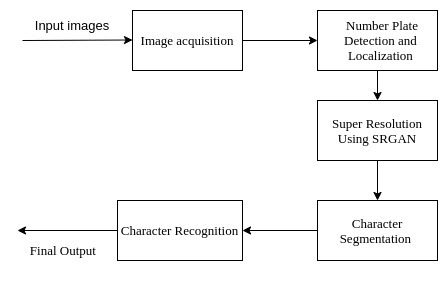

<h3>Automatic License Plate Recognition System for Distorted Images</h3>

Conjunction of Automatic License Plate Recognition (ALPR) with Super Resolution Generative Adversarial Network (SRGAN). 

> The ALPR system for distorted images augments the efficiency and accuracy of the Traditional ALPR system by refining the quality and resolution of the localized images using SRGAN.

<h4 style="display: inline-block">Model Architecture</h4>

<h4 style="display: inline-block">Methodology</h4>
<ol>
  <li>License Plate Detection and Localization- Using WPOD-NET</li>
  <li>Super Resolution - Using SRGAN</li>
  <li>Character Segmentation - Using contour-based approach</li>
  <li>haracter Recognition - Using SVM</li>
</ol>

<h4 style="display: inline-block">Usage</h4>
<ol>
  <li>Number plate Recognition.</li>
  <ul>
      <li>Automatic License Plate Recogntion.</li>
      <li>Automatic License Plate Recognition with SRGAN.</li>
   </ul>
</ol>

<h4 style="display: inline-block">Roadmap</h4>

> **Training files** consists of ALPR modules and SRGAN that can be used for training the architecture on future datasets.  
 
> **ALPR** consist code for  License plate detection, localization, segmentation and recognition.
 
> **ALPR for distorted images** consist code for License plate detection, localization, super-resolution, segmentation and recogniton.
 
> **Trained Models** consist of ALPR model and SRGAN model already trained on Nepal's gandaki zone dataset that can be loaded for further purposes.
